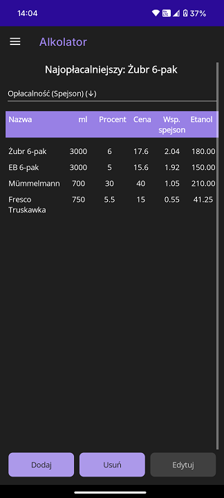

# Alkolator
Aplikacja na Androida wyliczająca jaki napój alkoholowy najbardziej opłaca się kupić pod względem zawartości etanolu. Napisana w .NET MAUI

# Wstęp
Chyba każdy kto lubi sobie raz na jakiś czas wypić trochę więcej alkoholu (czy to na imprezie czy tak o po prostu) miał taką sytuację, że wchodzi do sklepu po jakiś trunek i się zastanawia czy bardziej opłaca się kupić czteropaka tańszego piwa które ma 5% czy może trzy droższe piwa 6%? Właśnie dlatego napisałem tą aplikację, która odmieni los takich właśnie osób i pomoże im finalnie zadecydować co dzisiaj wypić. 

# Screenshot aplikacji

